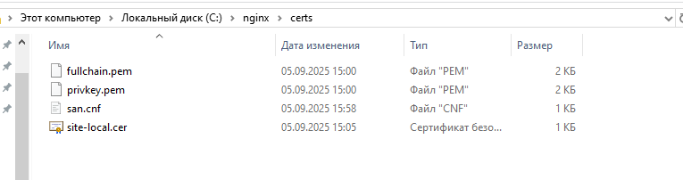
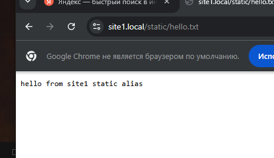
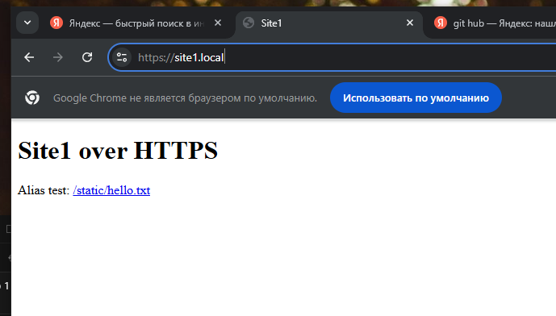
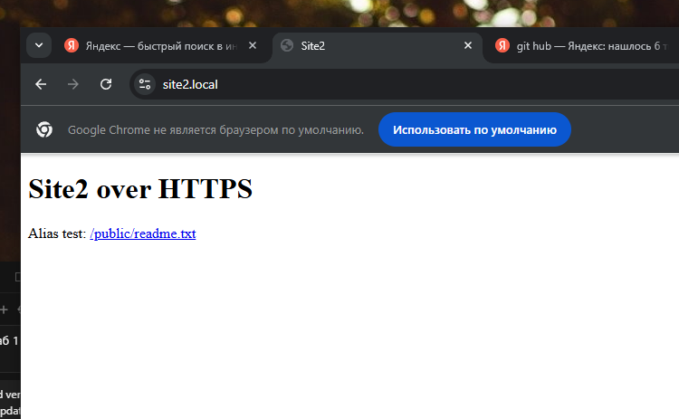

# Отчет по лабораторной работе: Настройка Nginx с HTTPS и виртуальными хостами

## Задачи

1. Настроить Nginx для работы по HTTPS с использованием SSL/TLS сертификатов
2. Реализовать принудительное перенаправление HTTP-запросов (порт 80) на HTTPS (порт 443)
3. Настроить использование alias для создания псевдонимов путей к файлам и каталогам
4. Сконфигурировать виртуальные хосты для обслуживания нескольких доменных имен на одном сервере
5. Обеспечить корректную маршрутизацию запросов к соответствующим пет-проектам

## Описание реализации

### 1. Настройка SSL/TLS сертификатов

Для обеспечения безопасного HTTPS-соединения были созданы самоподписанные SSL-сертификаты для обоих доменов. Процесс создания сертификатов включает:
- Генерацию приватного ключа для каждого домена
- Создание запроса на подписание сертификата (CSR)
- Генерацию самоподписанного сертификата
- Размещение сертификатов и ключей в соответствующих директориях на сервере

### 2. Конфигурация виртуальных хостов

Было создано два виртуальных хоста, каждый для своего домена и соответствующего пет-проекта:

#### Виртуальный хост для первого проекта (site1)

В конфигурации первого виртуального хоста настроены следующие параметры:
- **Server name**: доменное имя первого проекта
- **HTTP (порт 80)**: блок с перенаправлением всех HTTP-запросов на HTTPS
- **HTTPS (порт 443)**: основной блок с настройками SSL
  - Указаны пути к SSL-сертификату и приватному ключу
  - Настроены параметры безопасности SSL
  - Определен корневой каталог проекта (root directive)
  - Использован alias для перенаправления путей согласно требованиям проекта

Особенностью конфигурации является использование директивы `alias` для создания псевдонимов путей, что позволяет гибко управлять структурой URL и физическим расположением файлов на сервере.

#### Виртуальный хост для второго проекта (site2)

Аналогичным образом настроен второй виртуальный хост:
- Собственное доменное имя для второго проекта
- Перенаправление HTTP на HTTPS
- Настройки SSL с отдельным сертификатом
- Использование alias для кастомизации путей доступа к файлам проекта

### 3. Принудительное перенаправление HTTP на HTTPS

Для обоих виртуальных хостов реализовано принудительное перенаправление всех HTTP-запросов на HTTPS. Это обеспечивается отдельным блоком `server` для порта 80, который содержит:
- Директиву `return 301` или `rewrite` для постоянного перенаправления (301 Moved Permanently)
- Переадресацию на тот же самый хост, но с протоколом HTTPS и портом 443

Такая настройка гарантирует, что пользователи, пытающиеся получить доступ к сайтам по HTTP, автоматически перенаправляются на безопасное HTTPS-соединение.

### 4. Использование директивы alias

Директива `alias` использована для настройки псевдонимов путей. Это позволяет:
- Создавать дружественные для пользователя URL
- Абстрагировать физическую структуру файлов на сервере от логической структуры URL
- Организовывать гибкую маршрутизацию запросов внутри одного виртуального хоста

В конфигурации alias применен для создания маршрутов, которые соответствуют логике работы пет-проектов.

## Описание пет-проектов

### Проект 1 (site1)

Первый пет-проект представляет собой простое веб-приложение, демонстрирующее базовую функциональность. Проект доступен по первому доменному имени и обслуживается первым виртуальным хостом Nginx.

### Проект 2 (site2)

Второй пет-проект - независимое веб-приложение, работающее на том же сервере, но обслуживаемое через отдельный виртуальный хост. Проект имеет собственное доменное имя и использует отдельный SSL-сертификат.

## Результаты

### Проверка работы первого проекта

Ниже представлены скриншоты, демонстрирующие успешную работу первого проекта:

Как видно из скриншотов, первый проект успешно доступен по HTTPS, подключение защищено SSL-сертификатом.

### Проверка работы второго проекта

Аналогичным образом протестирован второй проект:

### Проверка перенаправления HTTP на HTTPS

Было проверено автоматическое перенаправление HTTP-запросов на HTTPS. При попытке доступа к любому из проектов по HTTP происходит автоматическое перенаправление на HTTPS-версию с кодом ответа 301 (Moved Permanently).
