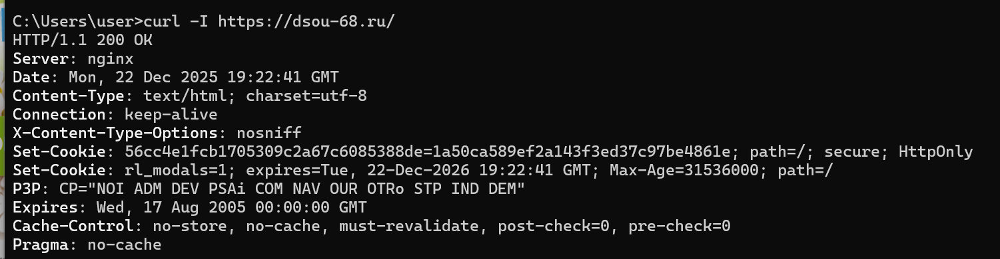
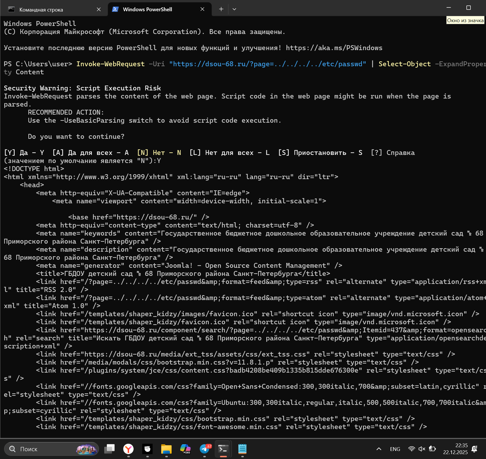
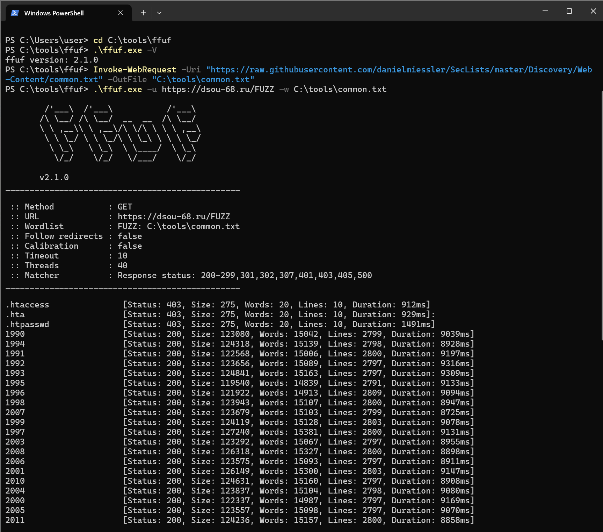
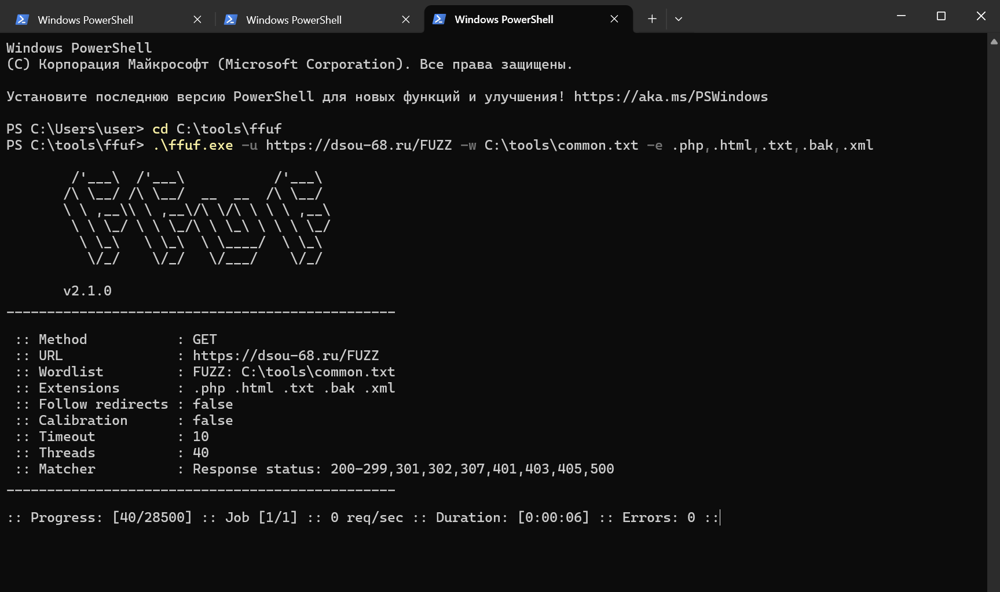
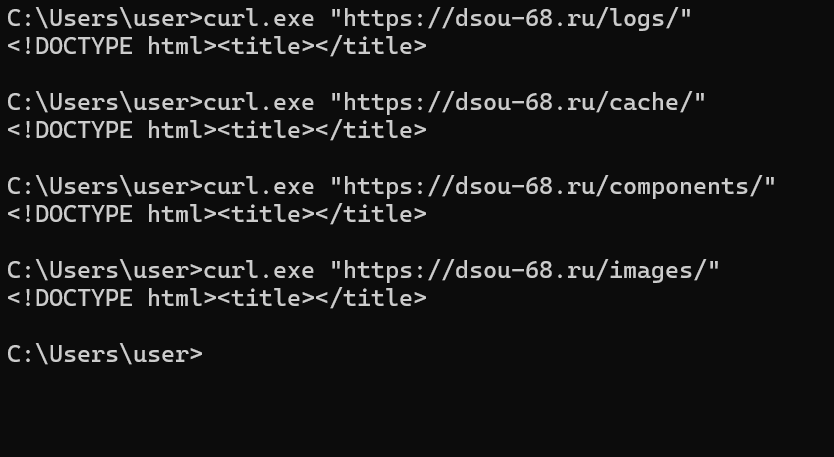

# Отчёт по лабораторной работе №1*  
**Тема:** проверка 3 уязвимостей веб-сайта (web security testing)  
**Сайт для препарирования:** https://dsou-68.ru/  

---

## 1. Цель работы
Провести проверку **минимум трёх уязвимостей/классов уязвимостей** на выбранном сайте и зафиксировать ход работ и результат (успех/неуспех) со скриншотами.

Проверялись:
1) **Content Discovery / Forced Browsing** (перебор директорий и страниц)  
2) **Directory Listing** (листинг каталогов)  
3) **Path Traversal / LFI** (попытка чтения файлов через параметр)

---

## 2. Краткое описание сайта
Сайт отвечает по HTTPS. По заголовкам ответа определяется веб-сервер **nginx** (см. скриншот 1). По HTML-коду (meta generator) определяется CMS **Joomla!** (см. скриншот 2).

---

## 3. Рабочий процесс 

### 3.1 Рекогносцировка: HTTP-заголовки
Выполнен запрос к главной странице с просмотром заголовков ответа. 
- `HTTP/1.1 200 OK`
- `Server: nginx`
- `X-Content-Type-Options: nosniff`
- cookies с флагами `secure`, `HttpOnly`
- отключено кеширование (`Cache-Control: no-store/no-cache`, `Pragma: no-cache`)

**Пруф:**  

---

### 3.2 Проверка Path Traversal / LFI через параметр `page` (попытка)
Проверено, как сайт обрабатывает параметр `page` при передаче значений, похожих на обход директорий.  
**Наблюдение:** в ответ возвращается **штатная HTML-страница**, прямое чтение системного файла не выходит. При этом параметр **отражается в HTML** (в ссылках/alternate-feed), что рассматривается как потенциально рискованное поведение при неправильной фильтрации.

**Пруф:**  

---

### 3.3 Content Discovery (ffuf): перебор директорий/файлов
Запущен `ffuf` со словарём `common.txt` для поиска неочевидных путей.  
Фильтр ответов: **Status 200, 301, 302, 403**.

#### Сводка результатов ffuf (ключевые находки)
- **Административная панель Joomla:**  
  `/administrator/` → **301**  
  Значение: обнаружена стандартная панель входа Joomla (риск при слабых учётных данных/уязвимостях CMS или расширений).

- **Директория логов:**  
  `/logs/` → **301**  
  Значение: директория существует; риск повышается, если где-то появляется доступ к содержимому логов.

- **Стандартные системные директории Joomla:**  
  `/bin/`, `/cache/`, `/components/`, `/includes/`, `/language/`, `/layouts/`, `/libraries/`, `/media/`, `/modules/` → **301**  
  Значение: подтверждают структуру CMS (fingerprinting), повышают эффективность дальнейшего анализа.

- **Защищённые системные файлы/пути:**  
  `/.htaccess`, `/.htpasswd`, `/.hta`, `/cgi-bin/` → **403**  
  Значение: прямой доступ запрещён (это хорошо), но факт обработки/существования пути подтверждается кодами ответа.

- **Публичные страницы и архивы:**  
  `/contacts`, `/Search`, `/1990–/2022`, `/2257`, `/400` → **200**  
  Значение: обнаружены доступные страницы; часть контента найдена перебором (forced browsing).

**Пруфы:**  
  
  

---

### 3.4 Проверка Directory Listing (листинга каталогов) и организационные нюансы
После активного перебора `ffuf` ресурс начал отвечать ограничениями на исходном источнике запросов (типичное поведение для rate limiting / антибот-защиты). Для завершения проверки **Directory Listing** проверка была продолжена из альтернативного источника доступа (без попыток изменения данных сайта и без попыток обхода авторизации).

Проверены каталоги, найденные на шаге ffuf:
- `/logs/`
- `/cache/`
- `/components/`
- `/images/`

**Результат:** при обращении к данным путям сервер отдаёт HTML-страницу-заглушку, **листинг содержимого каталогов не выводится**.  
Вывод: **Directory Listing выключен**.

**Пруф:**  

---

## 4 Итоговый вывод

### 4.1 Content Discovery
* **Суть проверки:** поиск скрытых/неочевидных путей перебором.  
*  выявлены `/administrator/`, `/logs/`, ряд стандартных директорий Joomla (301), а также страницы/архивы (200).  
*  успешно (найдены пути, которые не обязательно очевидны пользователю без перебора).

---

### 4.2 Directory Listing — не подтверждено (защита включена)
* **Суть проверки:** проверка выдачи списка файлов при открытии каталогов.  
* для `/logs/`, `/cache/`, `/components/`, `/images/` листинг не отображается.  
* уязвимость не обнаружена; **Directory Listing выключен**.

---

### 4.3 Path Traversal / LFI — не подтверждено
* **Суть проверки:** попытка чтения файлов через параметр (ошибка в валидации пути).  
*  прямое чтение файлов не подтверждено; возвращается HTML сайта. Параметр отражается в HTML, что отмечено как потенциально рискованное поведение при неправильной фильтрации, но эксплуатация не доказана.  
*  уязвимость не подтверждена.  

---

