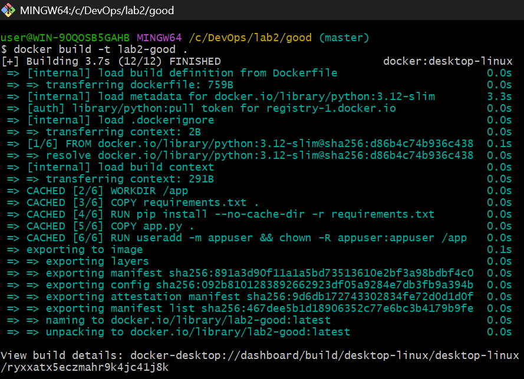
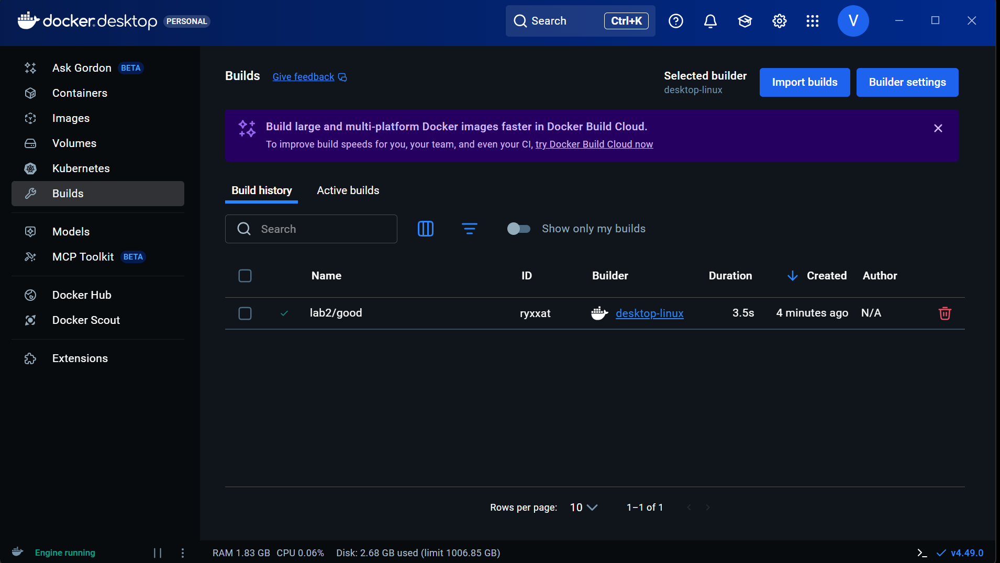

# Лабораторные работы

Здесь описана **Лабораторная №2 — Docker и Docker Compose**.

---

## Структура

```text
 bad
 ├── app.py
 ├── requirements.txt
 ├── Dockerfile
 └── docker-compose.yml
 good
 ├── app.py
 ├── requirements.txt
 ├── Dockerfile
 └── docker-compose.yml
````

---

## Хороший вариант 

### Как запускать

```bash
cd lab2/good
docker build -t lab2-good .
docker compose up
```

Запускаем билд:

Проверяем compose в Docker Desktop:

Приложение будет доступно по адресу: http://localhost:8080/  
Страница в браузере:

---

### Хорошие практики в Dockerfile (`lab2/good/Dockerfile`)

1. **Лёгкий базовый образ с фиксированной версией**

   ```dockerfile
   FROM python:3.12-slim
   ```

   * Специализированный образ под Python, без лишнего мусора.
   * Фиксированная версия → сборка воспроизводима, нет сюрпризов от `latest`.

2. **Отдельный слой для зависимостей и минимальный COPY**

   ```dockerfile
   WORKDIR /app

   COPY requirements.txt .
   RUN pip install --no-cache-dir -r requirements.txt

   COPY app.py .
   ```

   * Сначала ставятся зависимости, потом копируется код.
   * Пока `requirements.txt` не меняется, слой с `pip install` кэшируется → быстрые пересборки.
   * В контейнер не летит весь контекст проекта, только нужные файлы.

3. **Запуск не от root**

   ```dockerfile
   RUN useradd -m appuser && chown -R appuser:appuser /app
   USER appuser
   ```

   * Приложение запускается от отдельного пользователя.
   * Если что-то взломают — это не root внутри контейнера → безопаснее.

4. **Явный порт и понятная команда запуска**

   ```dockerfile
   EXPOSE 8000
   CMD ["python", "app.py"]
   ```

   * Видно, какой порт слушает приложение.
   * Команда запуска простая и читаемая.

---

### Хорошие практики в `docker-compose.yml` (`lab2/good/docker-compose.yml`)

1. **Нормальные сети и изоляция сервисов**

   ```yaml
   services:
     web:
       networks:
         - web_net

     db:
       networks:
         - db_net

   networks:
     web_net:
       driver: bridge
     db_net:
       driver: bridge
   ```

   * У каждого сервиса своя сеть.
   * Контейнеры `web` и `db` поднимаются вместе, но **по сети друг друга не видят** (нет общей сети).
   * Это как раз требование «контейнеры поднимаются, но не видят друг друга».

2. **Фиксированная версия БД**

   ```yaml
   db:
     image: mysql:8.0
   ```

   * Нет `latest`, чётко задана версия.
   * Обновление БД — только вручную, а не случайно.

3. **База не проброшена наружу**

   В сервисе `db` нет секции `ports`.

   * БД доступна только из docker-сетей.
   * Нет лишнего открытого порта на хосте.

4. **Использование volume для данных БД**

   ```yaml
   db:
     volumes:
       - db_data:/var/lib/mysql

   volumes:
     db_data:
   ```

   * Данные живут в томе, а не внутри контейнера.
   * Пересоздание контейнера не убивает базу.

---

## Плохой вариант 

### Как запускать

```bash
cd lab2/bad
docker build -t lab2-bad .
docker compose up
```

Из-за `network_mode: host` и прочих «кривостей» поведение и порты могут вести себя странно — это специально, как пример плохих практик.

---

### Плохие практики в Dockerfile (`lab2/bad/Dockerfile`) и как они исправлены

#### 1. Тяжёлый базовый образ + `latest`

**Плохо:**

```dockerfile
FROM ubuntu:latest
```

* Огромный образ, куча лишних пакетов.
* `latest` → сегодня одна версия, завтра другая.

**Исправление в хорошем варианте:**

```dockerfile
FROM python:3.12-slim
```

* Специализированный, лёгкий образ.
* Версия зафиксирована, сборки повторяемые.
* Итог: образ меньше, быстрее скачивается/собирается.

---

#### 2. `ADD . /app` и копирование всего подряд

**Плохо:**

```dockerfile
ADD . /app
```

* В контейнер улетает весь контекст: `.git`, временные файлы и т.д.
* `ADD` умеет слишком много и здесь не нужен.

**Исправление:**

```dockerfile
COPY requirements.txt .
RUN pip install --no-cache-dir -r requirements.txt
COPY app.py .
```

* Копируются только нужные файлы.
* Используется простой `COPY`.
* Образ чище, меньше мусора.

---

#### 3. Неоптимальная установка зависимостей

**Плохо:**

```dockerfile
ADD . /app
RUN pip3 install -r requirements.txt
```

* Любое изменение в коде ломает кэш `pip install`.
* Всё ставится заново при каждой мелкой правке.

**Исправление:**

```dockerfile
COPY requirements.txt .
RUN pip install --no-cache-dir -r requirements.txt
COPY app.py .
```

* Зависимости ставятся отдельно от кода.
* Кэш по зависимостям переиспользуется.
* Сборка быстрее.

---

#### 4. Запуск под root

**Плохо:**

```dockerfile
# пользователь по умолчанию root
CMD ["python3", "app.py"]
```

* Если в приложении дырка — это сразу root внутри контейнера.
* Можно повредить файлы на хосте через volume.

**Исправление:**

```dockerfile
RUN useradd -m appuser && chown -R appuser:appuser /app
USER appuser
```

* Отдельный пользователь для приложения.
* Повышение безопасности.

---

## docker-compose: плохие практики (`lab2/bad/docker-compose.yml`) и исправления

Файлы:

* плохой: `lab2/bad/docker-compose.yml`
* хороший: `lab2/good/docker-compose.yml`

### 1. `network_mode: host`

**Плохо (bad):**

```yaml
services:
  web:
    network_mode: host
  db:
    network_mode: host
```

* Почти нет сетевой изоляции.
* Возможны конфликты портов с сервисами на хосте.
* Плохо переносится между ОС.

**Исправление (good):**

```yaml
services:
  web:
    networks:
      - web_net

  db:
    networks:
      - db_net

networks:
  web_net:
    driver: bridge
  db_net:
    driver: bridge
```

* У сервисов свои сети.
* Контейнеры из разных сетей друг друга не видят.
* В то же время `docker compose up` поднимает их вместе.

---

### 2. Использование `mysql:latest`

**Плохо:**

```yaml
image: mysql:latest
```

* Версия БД может поменяться в любой момент.
* После очередного `docker pull` проект неожиданно ломается.

**Исправление:**

```yaml
image: mysql:8.0
```

* Конкретная версия.
* Обновляемся только сознательно.

---

### 3. Проброс порта БД наружу

**Плохо:**

```yaml
ports:
  - "3306:3306"
```

* БД торчит наружу, доступна извне.
* Лишняя поверхность атаки.

**Исправление:**

В хорошем варианте у `db` **нет** секции `ports`:

```yaml
# у db нет ports
```

* База доступна только изнутри docker-сетей.

---

### 4. Секреты в открытом виде в compose

**Плохо (bad):**

```yaml
environment:
  - DB_USER=root
  - DB_PASSWORD=supersecret
  - MYSQL_ROOT_PASSWORD=supersecret
```

* Пароли лежат прямо в файле (часто ещё и в git).
* Один и тот же пароль везде.

**Частично лучше (good, для учебной задачи):**

```yaml
environment:
  - MYSQL_DATABASE=app
  - MYSQL_USER=app
  - MYSQL_PASSWORD=app-password
  - MYSQL_ROOT_PASSWORD=change-me
```

* Отдельный пользователь для приложения.
* Пароль root другой.
* В реальном проекте секреты выносились бы в `.env` / secrets.

---

## Плохие практики по работе с контейнерами (НЕ про Dockerfile)

### 1. `--privileged` + слишком широкие монтирования

**Антипаттерн:**

```bash
docker run --privileged -v /:/host my-image
```

* Контейнер получает почти полный доступ к хосту.
* Монтируется вся файловая система `/`.
* Любая уязвимость в приложении = проблема для всей системы.

**Как лучше:**

* Не использовать `--privileged`, если можно без него.
* Монтировать только нужные директории.
* По возможности — read-only тома.

---

### 2. Хранить данные только внутри контейнера

**Антипаттерн:**

```bash
docker run --name my-db mysql:8.0
```

* Все данные живут в FS контейнера.
* Пересоздали контейнер — потеряли базу.

**Как лучше:**

```bash
docker run -v my_db_data:/var/lib/mysql mysql:8.0
```

* Использовать volumes/bind-монтирования.
* Тогда данные переживают пересоздание контейнеров.

```

::contentReference[oaicite:0]{index=0}
```
